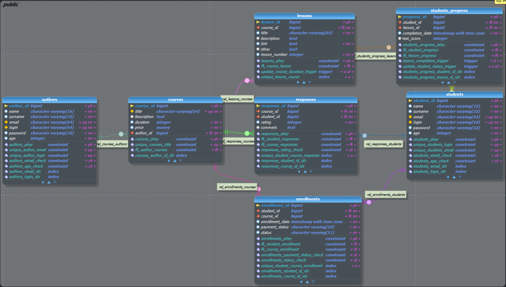
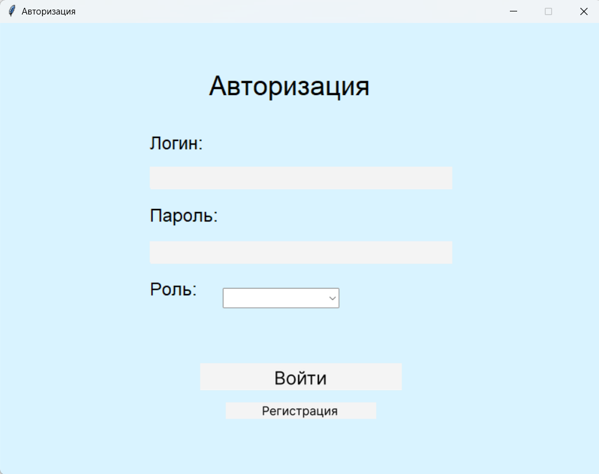
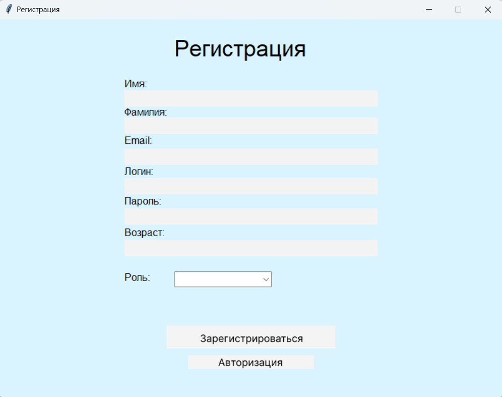
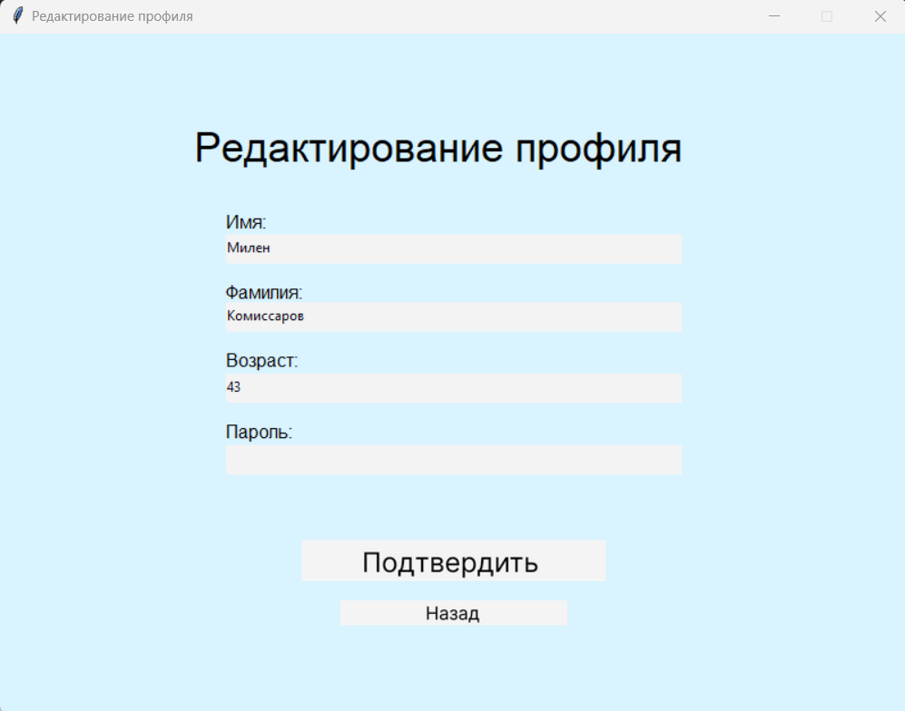
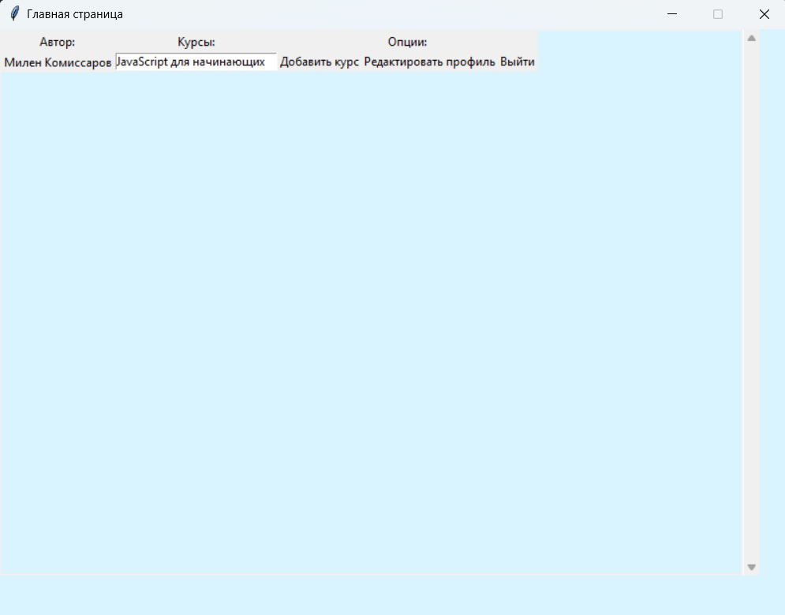
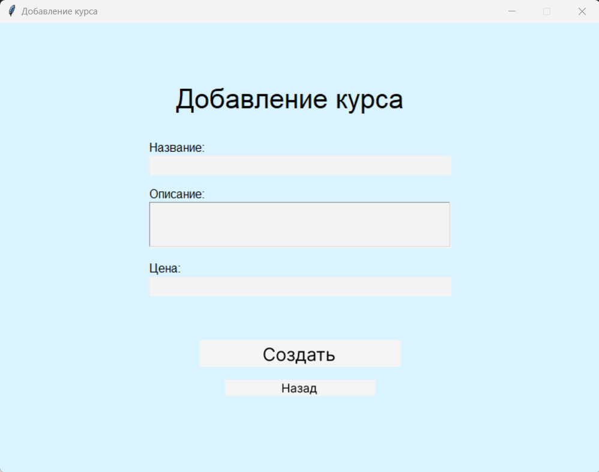
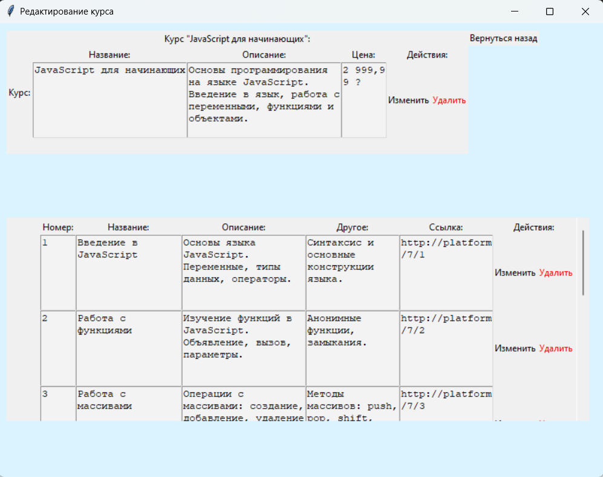
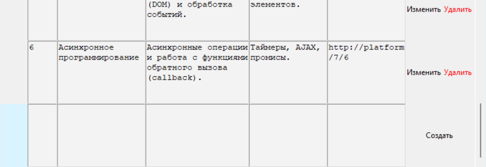

# Платформа курсов

## Описание базы данных и приложения

### 1. Описание базы данных
База данных предназначена для хранения информации о курсах, студентах, авторах и их прогрессе. Она включает в себя следующие основные таблицы:

- **authors**: содержит информацию об авторах курсов (ID, имя, фамилия, логин, и т.д.).
- **courses**: содержит информацию о курсах (ID, название, описание, цена, автор).
- **students**: содержит информацию о студентах (ID, имя, фамилия, логин, и т.д.).
- **enrollments**: связывает студентов с курсами, на которые они записаны.
- **lessons**: содержит информацию об уроках в каждом курсе.
- **students_progress**: отслеживает прогресс студентов по урокам.
- **responses**: хранит отзывы студентов на пройденные курсы.

### 1.2 Описание приложения
Приложение предоставляет графический интерфейс для взаимодействия с базой данных. Доступно две роли в соответствии со структурой базы данных (студенты и авторы). Студенты могут просматривать доступные курсы, записываться на них, отмечать выполненные уроки и видеть свой прогресс по каждому курсу. Авторы могут создавать курсы и уроки и редактировать их. Приложение разделено на несколько окон, каждое из которых имеет свои функции.

#### 1.2.1 Окно авторизации
Окно авторизации позволяет пользователям входить в систему, вводя свои учетные данные (логин и пароль).

#### 1.2.2 Окно регистрации
Окно регистрации позволяет новым пользователям создавать учетную запись, заполнив необходимые данные.

#### 1.2.3 Окно редактирования профиля
Окно, позволяющее пользователю редактировать информацию о своем профиле.

#### 1.2.4 Окно главного меню авторах
Главное окно, отображающее основную информацию о пользователе (авторе) и список его курсов. Также предоставляет функции для добавления нового курса, редактирования профиля и выхода из системы.

#### 1.2.5 Окно создания курса
Окно, позволяющее автору добавить новый курс, заполнив поля для названия, описания и цены курса.

#### 1.2.6 Окно редактирования курса
Окно, позволяющее автору редактировать информацию о выбранном курсе и управлять уроками.

